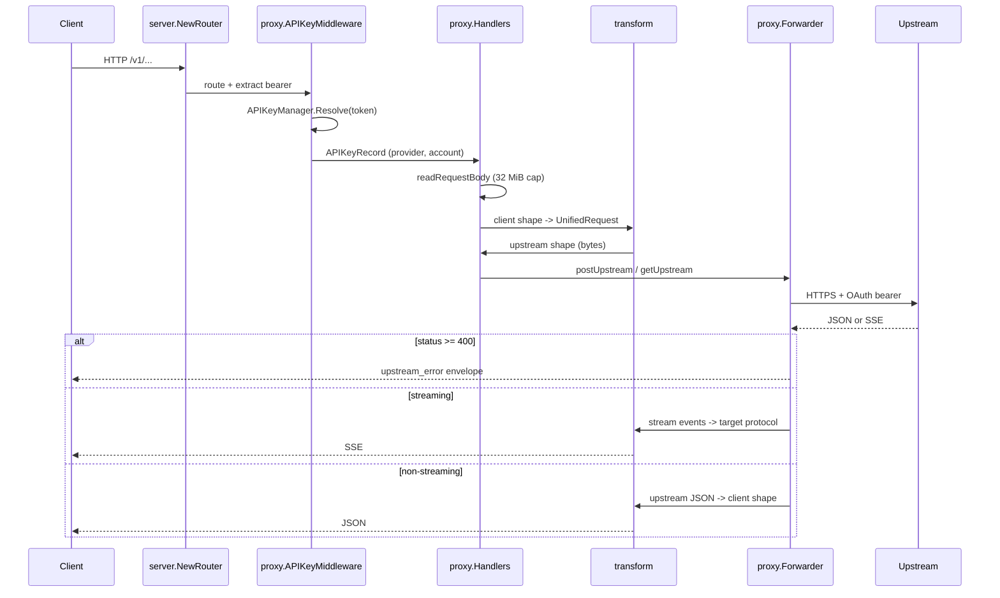

# Architecture

This document gives new contributors a working mental model of `llm-proxy`
in one read. It is intentionally light on prose and heavy on pointers into
the source.

For OAuth specifics, see [OAuth and Token Lifecycle](oauth.md).
For error response shapes, see [Error Responses](errors.md).

## Component Map

`llm-proxy` is a single Go binary built from [cmd/llm-proxy/](../cmd/llm-proxy/).
At runtime the binary wires the following internal packages together.

| Package | Responsibility |
| --- | --- |
| [`internal/config`](../internal/config/config.go) | Resolves the data directory, host, port, and other process configuration. |
| [`internal/app`](../internal/app/app.go) | Constructs the long-lived application object that owns the auth managers and the API key store. |
| [`internal/auth`](../internal/auth/) | OAuth managers for Codex ([`codex.go`](../internal/auth/codex.go)) and GitHub Copilot ([`copilot.go`](../internal/auth/copilot.go)), local `lpk_...` API key store ([`apikey.go`](../internal/auth/apikey.go)), and on-disk file layout ([`store.go`](../internal/auth/store.go)). |
| [`internal/server`](../internal/server/router.go) | Builds the Gin router, mounts middleware, and binds HTTP paths to handlers. |
| [`internal/proxy`](../internal/proxy/) | Middleware ([`middleware.go`](../internal/proxy/middleware.go)), HTTP handlers ([`handlers.go`](../internal/proxy/handlers.go)), upstream forwarder ([`forward.go`](../internal/proxy/forward.go)), and the local `doctor` check ([`doctor.go`](../internal/proxy/doctor.go)). |
| [`internal/transform`](../internal/transform/) | Shape conversion between Anthropic Messages, OpenAI Chat Completions, and OpenAI Responses through a `UnifiedRequest`/`UnifiedResponse` intermediate. Streaming conversion lives in [`stream.go`](../internal/transform/stream.go). |

The `App` struct in [internal/app/app.go](../internal/app/app.go) is the single
composition root that hands the auth managers and API key store to the proxy
layer:

```10:13:internal/app/app.go
	Config  *config.Config
	Codex   *auth.CodexOAuthManager
	Copilot *auth.CopilotAuthManager
	APIKeys *auth.APIKeyManager
```

## HTTP Surface

The router is small enough to read in one sitting. The unauthenticated
`/health` endpoint is mounted on the root engine; everything under `/v1` runs
through the API key middleware.

```16:25:internal/server/router.go
	r.GET("/health", h.Health)

	llm := r.Group("")
	llm.Use(proxy.APIKeyMiddleware(application))
	{
		llm.GET("/v1/models", h.GetModels)
		llm.POST("/v1/messages", h.PostMessages)
		llm.POST("/v1/chat/completions", h.PostChatCompletions)
		llm.POST("/v1/responses", h.PostResponses)
	}
```

The middleware reads `Authorization: Bearer lpk_...` (falling back to
`x-api-key`) and resolves the key against the local SQLite store. A failure
short-circuits with a 401; see [Error Responses](errors.md) for the shape.

## Request Lifecycle

Every authenticated request follows the same general path: middleware to
handler, handler to transform, transform to forwarder, forwarder to upstream,
and back through transform to the client.



The dispatch from method to handler is deliberately uniform:

```45:61:internal/proxy/handlers.go
func (h *Handlers) PostMessages(c *gin.Context) {
	rec, ok := APIKeyFromContext(c)
	if !ok {
		c.JSON(http.StatusUnauthorized, gin.H{"error": "unauthorized"})
		return
	}
	raw, ok := readRequestBody(c)
	if !ok {
		return
	}
	if err := h.forwarder.HandleAnthropicMessages(c.Writer, rec, raw); err != nil {
		if !c.Writer.Written() {
			writeProxyError(c, err)
		}
		return
	}
}
```

Request bodies are bounded by `MaxRequestBodyBytes` (32 MiB) in
[handlers.go](../internal/proxy/handlers.go). Once the body is read, the
handler delegates to a `Forwarder.Handle*` method based on the route, and the
forwarder picks the upstream and translation strategy from the
`APIKeyRecord.Provider` field.

## Translation Strategy

`llm-proxy` accepts three client-facing shapes and forwards to two upstream
shapes (Codex Responses, Copilot Chat Completions/Responses). To avoid an
N x M conversion matrix, the transform layer normalizes everything through a
single intermediate representation in
[internal/transform/unified.go](../internal/transform/unified.go).

```174:180:internal/transform/unified.go
type Format string

const (
	FormatAnthropic       Format = "anthropic_messages"
	FormatOpenAIChat      Format = "openai_chat_completions"
	FormatOpenAIResponses Format = "openai_responses"
)
```

A typical conversion is:

1. Parse the inbound JSON into a `UnifiedRequest` using the inbound format's
   reader (for example `AnthropicToUnifiedRequest` in
   [anthropic.go](../internal/transform/anthropic.go)).
2. Call `ValidateRequest(req, source, target)` in
   [unified.go](../internal/transform/unified.go) to surface unsupported
   feature combinations early as a structured
   `UnsupportedFeatureError` (see [Error Responses](errors.md)).
3. Render the `UnifiedRequest` into the outbound shape with the target
   format's writer (for example `RequestToOpenAIResponses` in
   [openai_responses.go](../internal/transform/openai_responses.go) and
   `ApplyCodexUpstreamRequest` in [codex.go](../internal/transform/codex.go)).

Responses follow the mirror path: the forwarder decodes the upstream JSON
into a `UnifiedResponse`, then renders it into the client's expected shape.

When the client endpoint and upstream endpoint already match (for example
`POST /v1/responses` on a Codex account), the forwarder uses a passthrough
path that copies bytes directly to preserve Responses-only fields. See
`HandleOpenAIResponses` in [forward.go](../internal/proxy/forward.go).

## Streaming Pipeline

Streaming SSE conversion is concentrated in
[internal/transform/stream.go](../internal/transform/stream.go). The
forwarder opens the upstream stream, hands the body to the appropriate
stream translator, and writes converted events to the client `http.ResponseWriter`
as `text/event-stream`. The conservative policy from
[docs/compatibility.md](compatibility.md) applies: events that have no
equivalent in the target protocol stop the stream rather than being invented
locally.

## Auth and Identity

The middleware resolves a bearer token to an `APIKeyRecord` whose `Provider`
and `AccountID` fields drive the rest of the request. The forwarder uses
those fields to look up the right upstream access token:

- Codex: `app.Codex.GetValidToken(accountID)` (refresh via OAuth refresh
  token, with a per-account refresh lock).
- Copilot: `app.Copilot.GetValidCopilotToken(accountID)` plus
  `GetAPIEndpoint(accountID)` for the per-account API base URL.

The details and failure modes of both flows live in
[OAuth and Token Lifecycle](oauth.md).

## Data Directory

Runtime data lives under `~/.llm-proxy/` by default. The schema, file modes,
and individual file purposes are documented in the
[Data Directory section of the README](../README.md#data-directory) and the
[on-disk OAuth file fields](oauth.md#on-disk-files). This document does not
duplicate that table.

## Observability

The only observability surface is the `LLM_PROXY_DEBUG=1` environment
variable, which causes the forwarder to log per-request lines to stderr with
method, label (e.g. `codex.chat.completions`), model, stream flag, upstream
URL, status, and duration. Debug logs deliberately omit API keys, OAuth
tokens, and full request bodies. Upstream error previews are truncated to
4 KiB.

Structured logging and metrics are not implemented; see
[Roadmap](roadmap.md).
