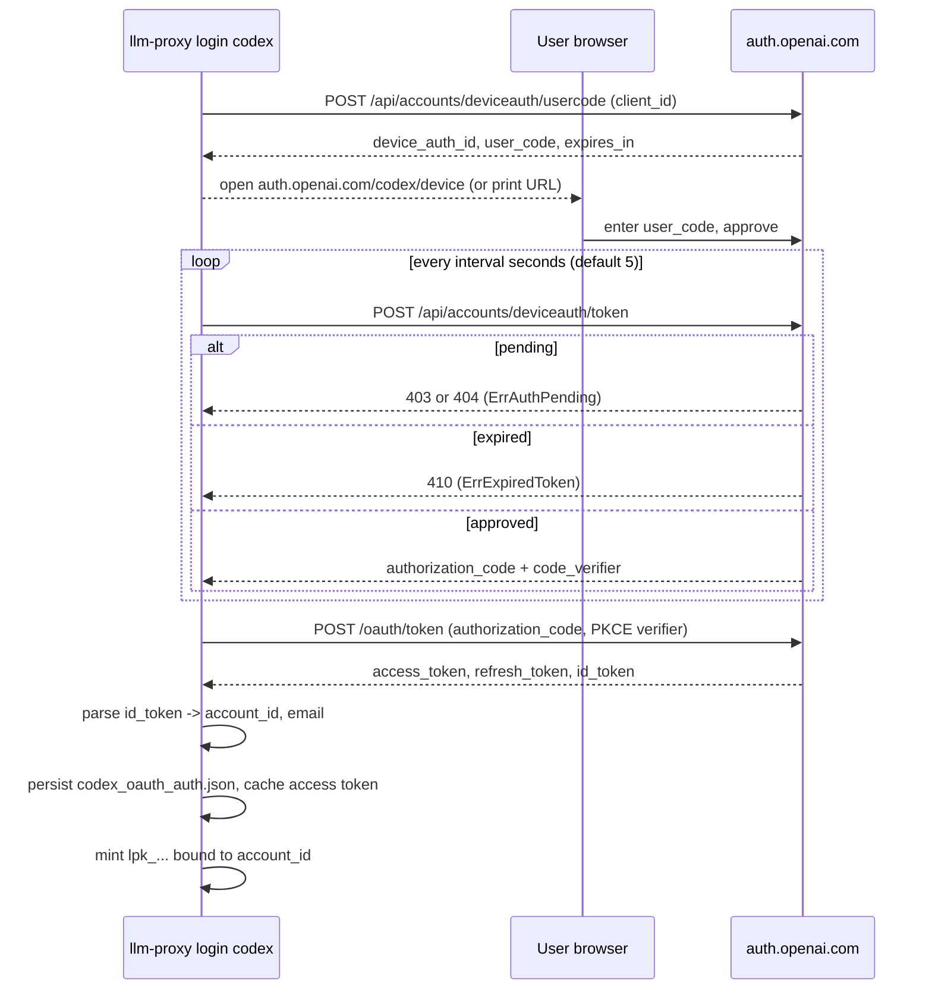
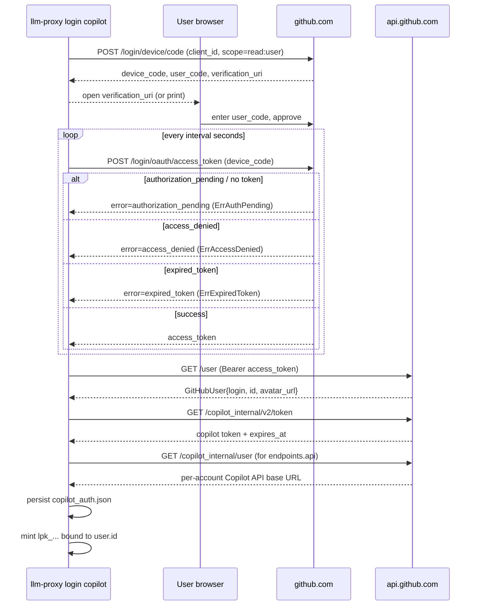

# OAuth and Token Lifecycle

`llm-proxy` is, at its core, an adapter that turns provider OAuth sessions
into local `lpk_...` API keys. This document explains how that adapter
works for each provider, what is stored where, and what users should do when
authentication fails.

The implementation lives entirely under [internal/auth/](../internal/auth/).
This document is descriptive, not prescriptive: behavior described here is
the current `main` behavior, and may evolve before `v1.0`. See
[Roadmap](roadmap.md) for stability commitments.

## Provider Matrix

| Aspect | Codex (OpenAI) | GitHub Copilot |
| --- | --- | --- |
| Flow | OpenAI device authorization with PKCE | GitHub OAuth device flow + Copilot token exchange |
| Public client ID | `app_EMoamEEZ73f0CkXaXp7hrann` (matches the official Codex CLI / cc-switch). See [constants.go](../internal/auth/constants.go). | `Iv1.b507a08c87ecfe98` (matches VS Code Copilot). |
| Scopes | `openid profile email` | `read:user` |
| Verification URL | `https://auth.openai.com/codex/device` | Returned by GitHub (typically `https://github.com/login/device`). |
| Token exchange host | `auth.openai.com` | `github.com` + `api.github.com` |
| Long-lived secret | OAuth refresh token | GitHub OAuth access token |
| Short-lived secret | OAuth access token (`expires_in` typically 1 h) | Copilot token from `/copilot_internal/v2/token` (`expires_at` Unix seconds) |
| Upstream API host | `chatgpt.com` (Responses API) | Per-account `endpoints.api` discovered from `/copilot_internal/user`. |
| GitHub Enterprise Server | n/a | Not supported (hardcoded to `github.com`). |

The hostnames above are the only egress destinations introduced by login.
They are also listed in the README's `Requirements` section.

## CLI Surface

Login is intentionally CLI-only. The HTTP server has no login or key
management endpoint. The relevant commands are:

```bash
llm-proxy login codex   [--no-browser]
llm-proxy login copilot [--no-browser]
llm-proxy keys list
llm-proxy keys create codex|copilot [--label NAME]
llm-proxy keys delete KEY_ID
llm-proxy doctor
```

`login` runs the device flow, persists the resulting OAuth session under
`~/.llm-proxy/`, mints a fresh `lpk_...` key bound to that account, and
prints the plaintext key once. The plaintext key is never stored: only a
SHA-256 hash plus metadata is persisted in `llm-proxy.db`.

`keys create` reuses an existing logged-in account and mints an additional
`lpk_...` key (useful for per-tool labels). `keys delete` revokes a key
locally; it does not revoke the underlying OAuth session.

## Codex Device Flow

The Codex flow follows the OpenAI device authorization shape with PKCE.
The bulk of the logic is in
[internal/auth/codex.go](../internal/auth/codex.go).



Notable details:

- Polling status codes are normalized to the package errors:
  `ErrAuthPending` (403/404), `ErrExpiredToken` (410, or local expiry),
  `ErrRefreshInvalid` (401/403 on refresh), `ErrAccessDenied` (Copilot only).
  These are defined in [codex.go](../internal/auth/codex.go).
- Account identity is extracted from the ID token (or the access token as a
  fallback) by `parseIDToken`. The first non-empty of
  `chatgpt_account_id`, `https://api.openai.com/auth.chatgpt_account_id`, or
  the first organization ID becomes the local `account_id`.
- The first successful login becomes the `defaultAccountID`. Subsequent
  logins add new accounts without changing the default.

## Copilot Device Flow

Copilot login is a two-step exchange: a standard GitHub OAuth device flow,
followed by a Copilot-specific token exchange.



The Copilot API base URL is discovered per account and cached in memory; it
is refreshed lazily when missing (see `GetAPIEndpoint` in
[copilot.go](../internal/auth/copilot.go)). The cached endpoint is not
persisted to disk.

## Token Lifecycle and Refresh

Both providers maintain a short-lived "API token" cached in memory plus a
long-lived "login secret" persisted to disk.

| Provider | Short-lived (memory) | Long-lived (disk) | Refresh trigger |
| --- | --- | --- | --- |
| Codex | `CachedAccessToken{Token, ExpiresAtMs}` | `refresh_token` in `codex_oauth_auth.json` | `IsExpiringSoon` -> within 60 s of expiry, exchange `refresh_token` at `/oauth/token`. |
| Copilot | `CopilotToken{Token, ExpiresAt}` | GitHub `access_token` in `copilot_auth.json` | `IsExpiringSoon` -> within 60 s of expiry, call `/copilot_internal/v2/token` with the GitHub token. |

Refresh windows and defaults come from
[constants.go](../internal/auth/constants.go):

```19:24:internal/auth/constants.go
	GitHubClientID           = "Iv1.b507a08c87ecfe98"
	GitHubDomain             = "github.com"
	CopilotUserAgent         = "llm-proxy-copilot"
	TokenRefreshBufferMs     = 60_000
	TokenRefreshBufferSec    = 60
	DeviceCodeDefaultExpires = 900
```

Refresh is concurrency-safe. Each account has its own `sync.Mutex`
(`refreshLocks`) so concurrent in-flight requests collapse into a single
refresh:

```376:383:internal/auth/codex.go
func (m *CodexOAuthManager) getRefreshLock(accountID string) *sync.Mutex {
	m.mu.Lock()
	defer m.mu.Unlock()
	if m.refreshLocks[accountID] == nil {
		m.refreshLocks[accountID] = &sync.Mutex{}
	}
	return m.refreshLocks[accountID]
}
```

For Codex, if the refresh endpoint returns a new `refresh_token`, the
manager rotates it on disk via `saveToDisk`. The Copilot flow does not
rotate the GitHub token; it only refreshes the short-lived Copilot token.

The Codex access token defaults to a 1 h validity if the upstream omits
`expires_in` (see `computeExpiresAtMs` in
[types.go](../internal/auth/types.go)).

## Failure Modes and Remediation

| Error (Go) | When it appears | User action |
| --- | --- | --- |
| `ErrAuthPending` | Poll succeeded but user has not yet approved. | Wait, or complete the browser approval. The CLI handles this internally. |
| `ErrExpiredToken` | Device code expired before approval (>= 15 min by default for Codex). | Re-run `llm-proxy login <provider>`. |
| `ErrAccessDenied` | GitHub returned `access_denied`. | Re-run `llm-proxy login copilot` and approve. |
| `ErrRefreshInvalid` | Codex refresh endpoint returned 401/403 (revoked, rotated, or invalid). | Re-run `llm-proxy login codex`. Existing `lpk_...` keys for that account become unusable until re-login. |
| `ErrAccountMissing` | No account exists for the resolved `account_id` (deleted on disk, or `defaultAccountID` empty). | Run `llm-proxy login <provider>`, or recreate keys with `llm-proxy keys create`. |
| `device flow not found; restart login` | The CLI restarted between issuing the device code and polling. | Re-run `llm-proxy login`. |
| GitHub `/user` or `/copilot_internal/v2/token` non-2xx | Network issue, revoked GitHub token, account without Copilot entitlement. | Verify Copilot subscription, then re-run `llm-proxy login copilot`. |

Run `llm-proxy doctor` to validate that the data directory is intact and
that the on-disk auth files are parseable. It does not make network calls
and will not detect a revoked refresh token; that is surfaced only when a
real request hits the upstream.

## On-Disk Files

All paths are relative to the data directory (default `~/.llm-proxy/`,
created with mode `0700`, files written with mode `0600`).

### `codex_oauth_auth.json`

Structure (see `CodexOAuthStore` in
[types.go](../internal/auth/types.go)):

```json
{
  "version": 1,
  "default_account_id": "user-XXXXXXXX",
  "accounts": {
    "user-XXXXXXXX": {
      "account_id": "user-XXXXXXXX",
      "email": "you@example.com",
      "refresh_token": "REDACTED",
      "authenticated_at": 1716540000
    }
  }
}
```

| Field | Purpose | Sensitive |
| --- | --- | --- |
| `version` | Schema version. Currently `1`. | no |
| `default_account_id` | Account used when a request does not pin one. | no |
| `accounts[].account_id` | ChatGPT account or organization ID. | low (account identifier) |
| `accounts[].email` | Extracted from the ID token, if present. | low |
| `accounts[].refresh_token` | OAuth refresh token, equivalent to login. | **yes - treat as a password** |
| `accounts[].authenticated_at` | Unix seconds at login time. | no |

The cached access token is held only in memory.

### `copilot_auth.json`

Structure (see `CopilotAuthStore` in
[types.go](../internal/auth/types.go)):

```json
{
  "version": 3,
  "default_account_id": "1234567",
  "accounts": {
    "1234567": {
      "github_token": "REDACTED",
      "github_domain": "github.com",
      "authenticated_at": 1716540000,
      "user": {
        "login": "octocat",
        "id": 1234567,
        "avatar_url": "https://avatars.githubusercontent.com/u/1234567"
      }
    }
  }
}
```

| Field | Purpose | Sensitive |
| --- | --- | --- |
| `version` | Schema version. Currently `3`. | no |
| `default_account_id` | Numeric GitHub user ID used as the local account key (or `domain:id` if non-default domain). | no |
| `accounts[].github_token` | GitHub OAuth access token. Grants `read:user` and is used to mint Copilot tokens. | **yes - treat as a password** |
| `accounts[].github_domain` | Always `github.com` today. Reserved for future GHES support. | no |
| `accounts[].user` | Cached GitHub profile. | low |
| `accounts[].authenticated_at` | Unix seconds at login time. | no |

The Copilot token and per-account API endpoint are held only in memory.

### `llm-proxy.db`

SQLite database that stores `APIKeyRecord` rows: `id`, `label`, `provider`,
`account_id`, `created_at`, key preview (first/last few chars), and an
optional `revoked_at`. The plaintext `lpk_...` is **not** stored: only its
SHA-256 hash is indexed. See [apikey.go](../internal/auth/apikey.go) for the
schema and `Resolve` / `Create` semantics.

### `api_keys.json` (legacy)

If present, it is imported into `llm-proxy.db` on startup and left in place.
New installations do not create this file.

## Multi-Account Behavior

- Each provider tracks its own `defaultAccountID`. They are independent.
- The first successful login sets the default; subsequent logins add to
  `accounts` without changing it.
- `llm-proxy keys create <provider>` binds a new key to the current default
  account for that provider. There is currently no CLI flag to choose a
  non-default account for new keys; bind by re-running `login` to switch
  the default if needed, or edit `default_account_id` on disk at your own
  risk.
- An `lpk_...` key is bound to one (`provider`, `account_id`) pair for its
  whole lifetime. Deleting the underlying account leaves the key resolvable
  by hash but causes upstream calls to fail with `ErrAccountMissing`.

## Safety Notes

- Do not commit, copy, or paste `codex_oauth_auth.json`, `copilot_auth.json`,
  `llm-proxy.db`, or any `lpk_...` value into issues, pull requests, chat
  transcripts, or screenshots. They are equivalent to your provider login.
- Revoke a compromised `lpk_...` with `llm-proxy keys delete KEY_ID`. To
  invalidate the underlying OAuth session, revoke the authorization in the
  provider's account settings (OpenAI account settings for Codex; GitHub
  `Settings -> Applications -> Authorized OAuth Apps` for Copilot).
- See [SECURITY.md](../SECURITY.md) for the project's overall security model
  and vulnerability reporting process.
